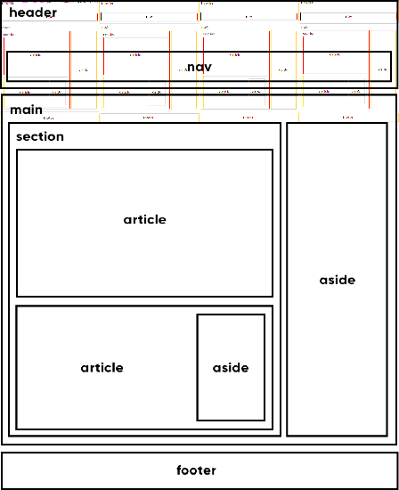

cap.16.2 - Tags semânticas 

# Grouping Tags e Semantic Tags

## Header

Cria áreas relativas a cabeçalhos. Pode ser o cabeçalho de um site ou até mesmo o cabeçalho de uma seção ou artigo. Normalmente inclui títulos &lt;h1&gt; - &lt;h6&gt; e subtítulos. Podem também conter menus de navegação.

## Nav

Define uma área que possui os links de navegação pela estrutura de páginas que vão compor o website. Um `<nav>` pode estar dentro de um `<header>`.

## Main

É um agrupador usado para delimitar o conteúdo principal do nosso site. Normalmente concentra as seções, artigos e conteúdos periféricos

## Section

Cria seções para sua página. Ela pode conter o conteúdo diretamente no seu corpo ou dividir os conteúdos em artigos com conteúdos específicos. Segundo a documentação oficial da W3C, “uma seção é um agrupamento temático de conteúdos, tipicamente com um cabeçalho”.

## Article

Um artigo é um elemento que vai conter um conteúdo que pode ser lido de forma independente e dizem respeito a um mesmo assunto. Podemos usar um `<article>` para delimitar um post de blog ou fórum, uma notícia, etc.

## Aside

Delimita um conteúdo periférico e complementar ao conteúdo principal de um artigo ou seção. Normalmente um conteúdo `<aside>` está posicionado ao lado de um determinado texto ou até mesmo no meio dele.

## Footer

Cria um rodapé para o site inteiro, seção ou artigo. É um conteúdo que não faz parte diretamente do conteúdo nem é um conteúdo periférico (o que caracterizaria um `<aside>`), mas possui informações sobre autoria do conteúdo, links adicionais, mapa do site, documentos relacionados.

## Exemplo de modelo

