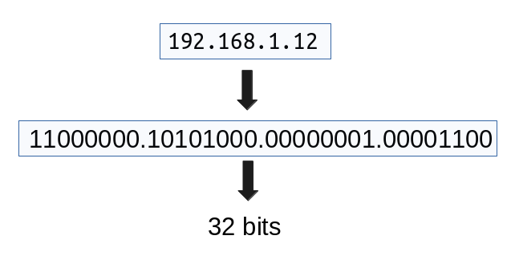
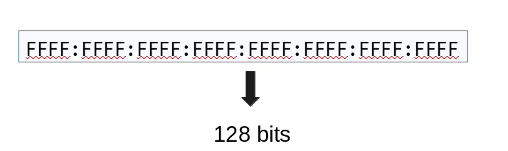

#Caracteristicas de IPv4

Todo mundo sabe oq é IP. Se você não souber de inicio já está muito perdido, mas OK.

[IP](https://pt.wikipedia.org/wiki/Endere%C3%A7o_IP) é um endereço (um número) para identificar alguém na rede. Tipo nos nossos bairros, cada casa tem um número, e o número é exclusivo e único.

Existem duas versões de IP. **IPv4** e **IPv6**.

O IPv4 usa 32 bits e IPv6 utiliza 128 bits mas para entender de onde vem esses números explicarei como isso funciona por baixo dos panos.

### IPv4

- Utiliza notação decimal => binário => 32 bits

Se para ti ficou abstrato veja essa imagem

Ou seja ficamos com 4 octetos (conjunto de 8 bits), conte os bits e perceberá o porquê dos 32 bits. Sabemos tambem que 1 byte = 8 bits, aqui sempre que quisermos se referir ao byte do IP, iremos chamar de octeto.

Para quem não sabe de onde vieram esses 0 e 1's recomendo que aprenda a fazer a conversão de decimal para binario e vice-versa é o básico e trivial.

### IPv6

- Utiliza notação hexadecimal => binario => 128 bits
- 8 grupos de 4 bytes

